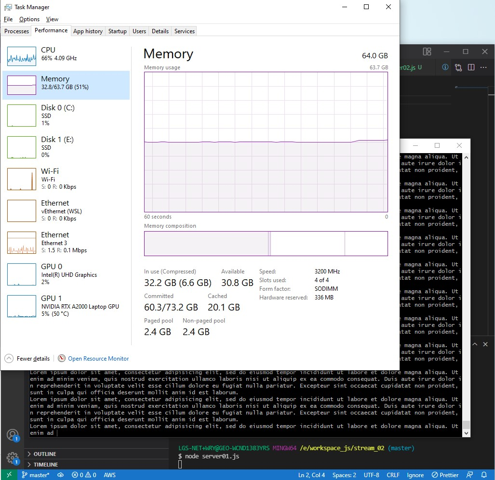

# stream_02
Learn about nodejs streams.
* [node js streams - everything you need to know](https://www.freecodecamp.org/news/node-js-streams-everything-you-need-to-know-c9141306be93/)

## 1. Setup
```bash
$ nvm use 16.13.0
Now using node v16.13.0 (64-bit)

$ vi createbigfile.js
$ node createbigfile.js 
$ ll
total 427M
drwxr-xr-x 1 LGS-NET+WRY 4096    0 Mar  6 17:34 ./
drwxr-xr-x 1 LGS-NET+WRY 4096    0 Mar  6 17:25 ../
-rw-r--r-- 1 LGS-NET+WRY 4096 427M Mar  6 17:34 big.file
```

## 2. File streams
### 2.1. Without _streams_
```bash
$ node server01.js
$ curl localhost:8001
```
There is about 400MB memory usage without using streams:


### 2.1. With _streams_
```bash
$ node server02.js
$ curl localhost:8001
```
There is very low memory usage by using streams:


## 3. Implementing streams
### 3.1. writable stream
```bash
$ vi writeable-stream01.js
$ node writable-stream.js 
lorem ipsum dolor
lorem ipsum dolor

sit amet
sit amet

the quick brown fox jumps over the lazy dog
the quick brown fox jumps over the lazy dog


$ vi writable-stream02.js
$ node writable-stream02.js
lorem
lorem
ipsum
ipsum
dolor
dolor
sit amet
sit amet
```

### 3.2. readable stream
```bash
$ vi readable-stream.js
$ node readable-stream.js 
lorem ipsum dolor sit ametthe quick brown fox jumps over a lazy dog
```

### 3.3. transform stream
```bash
$ vi transform-stream01.js
$ node transform-stream01.js 
ABCDEFGHIJKLMNOPQRSTUVWXYZ


lorem ipsum dolor sit amet
lorem ipsum dolor sit amet

B
B


$ node transform-stream02.js
the quick brown fox jumps over the lazy dog
THE QUICK BROWN FOX JUMPS OVER THE LAZY DOG
lorem ipsum dolor sit amet
LOREM IPSUM DOLOR SIT AMET

$ node transform-stream03.js 
Debugger attached.
a, b, c, d
{"a":" b"," c":" d"}
lorem, ipsum, dolor, sit, amet
{"lorem":" ipsum"," dolor":" sit"}

$ node transform-stream04.js big.file 
$ ll
total 429M
-rw-r--r-- 1 LGS-NET+WRY 4096 427M Mar  6 17:48 big.file
-rw-r--r-- 1 LGS-NET+WRY 4096 1.9M Mar  7 23:31 big.file.gz

$ node transform-stream05.js big.file
..................................................................................................................................................................................................................................Done
$ ll
total 429M
-rw-r--r-- 1 LGS-NET+WRY 4096 427M Mar  6 17:48 big.file
-rw-r--r-- 1 LGS-NET+WRY 4096 1.9M Mar  7 23:36 big.file.zz

$ node transform-stream06.js big.file
....................................................................... .
...............................................................................................................................................  .
..........Done
$ ll
total 429M
-rw-r--r-- 1 LGS-NET+WRY 4096 427M Mar  6 17:48 big.file
-rw-r--r-- 1 LGS-NET+WRY 4096 1.9M Mar  7 23:42 big.file.zz

```

### 3.4 Encryption/Decryptions streams
#### Encryption stream:
```js
const crypto = require('crypto');
// ...

fs.createReadStream(file)
  .pipe(zlib.createGzip())
  .pipe(crypto.createCipher('aes192', 'a_secret'))
  .pipe(reportProgress)
  .pipe(fs.createWriteStream(file + '.zz'))
  .on('finish', () => console.log('Done'));
```

#### Decryption stream:
```js
fs.createReadStream(file)
  .pipe(crypto.createDecipher('aes192', 'a_secret'))
  .pipe(zlib.createGunzip())
  .pipe(reportProgress)
  .pipe(fs.createWriteStream(file.slice(0, -3)))
  .on('finish', () => console.log('Done'));
```